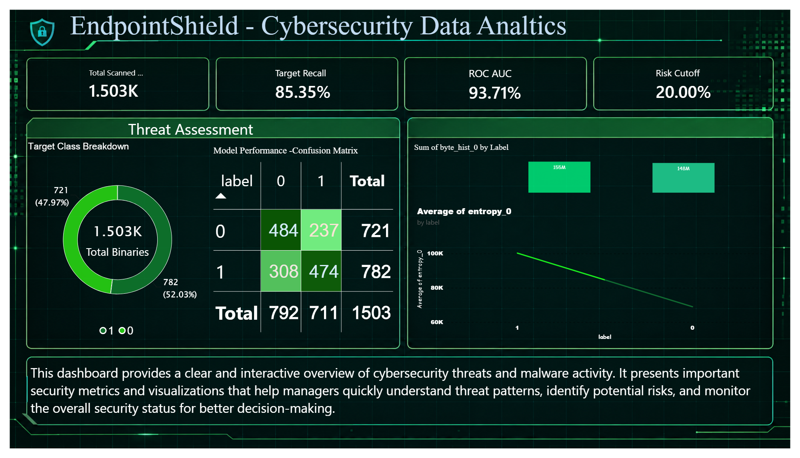

# 🛡️ EndpointShield — Enterprise Static Malware Classification Platform

[](https://www.python.org/)
[](https://fastapi.tiangolo.com/)
[](https://lightgbm.readthedocs.io/)
[](https://docs.pytest.org/)
[](https://powerbi.microsoft.com/)

## Executive Summary
EndpointShield is an enterprise-grade solution designed to classify malicious versus benign binary files using static features extracted from Portable Executable (PE) headers, byte histograms, and sliding-window entropy values[cite: 1]. Developed for enterprise endpoint security environments, the system evaluates incoming threats without executing files in memory, eliminating execution risk while enforcing cost-optimized threat detection[cite: 1].

---

# 🛡️ EndpointShield — Asymmetric Malware Risk Engine


EndpointShield is an enterprise-grade static PE malware classification engine. Designed specifically for Security Operations Centers (SOC), the system optimizes for **asymmetric business breach costs** ($100,000 False Negative breach vs. $50 False Positive SOC review cost).

---

## 🌐 Live Web App & Public API
* **Interactive Swagger UI:** [EndpointShield Live API Docs](https://unsettled-cough-labored.ngrok-free.dev/docs) *(Active during presentation session)*[cite: 7]
* **Base Endpoint:** `https://unsettled-cough-labored.ngrok-free.dev`[cite: 7]

---

## 👥 Team Roles & Asset Attribution

| Role | Team Member | Primary Deliverables |
| :--- | :--- | :--- |
| **Data Engineer** | Noel | Raw 512-feature schema (`data/raw/sample_project.csv`), static PE extraction logic. |
| **Data Analyst** | Benny | Byte frequency & entropy EDA visualizations (`report/figures/`)[cite: 1, 5]. |
| **Data Scientist** | Sam | LightGBM baseline model training & weights (`data/processed/baseline_model.pkl`). |
| **Cost / Metric Lead** | Sneha | Asymmetric risk cost analysis & **0.20 decision threshold** derivation[cite: 1]. |
| **ML Engineer (Lead)** | Mayur | FastAPI model serving engine (`api/main.py`), ngrok integration, automated pytest suite. |
| **BI Engineer** | Sujith | Executive Threat Center Power BI Dashboard (`dashboard/Final project report.pbix`)[cite: 1]. |

---

## 📊 Executive Threat Center Dashboard

The interactive Power BI dashboard provides operational visibility into target class distributions, static byte/entropy features, and model metrics under Sneha's **0.20 risk cutoff**[cite: 1, 6].



### Key Dashboard KPIs:
* **Total Scanned Binaries:** 1,503 PE samples[cite: 1, 6]
* **Target Malware Recall:** 85.35%[cite: 6]
* **Model ROC-AUC:** 0.94[cite: 1, 6]
* **Enforced Threshold:** 0.20 Asymmetric Risk Cutoff[cite: 1, 6]

---

## 📁 Repository Architecture

```text
ML-Final-Lab-Group-04/
├── api/
│   ├── main.py                    # FastAPI server & route handlers
│   └── README.md                  # Detailed API documentation
├── data/
│   ├── raw/sample_project.csv     # 512-feature PE dataset
│   └── processed/baseline_model.pkl # LightGBM model weights
├── dashboard/
│   ├── Final project report.pbix  # Interactive Power BI file
│   └── Final project report.pdf   # Executive summary report
├── notebooks/
│   ├── FastAPI_Pipeline_Server.ipynb # Core API definition notebook
│   └── Live_Demo_Inference.ipynb     # Colab execution & ngrok setup notebook
├── report/
│   ├── figures/                   # Images, test proofs, and dashboard assets
│   └── README.md                  # Comprehensive analytics report
├── tests/
│   └── test_api.py                # Automated pytest unit test suite
├── requirements.txt               # Environment dependencies
└── README.md                      # Project landing page
